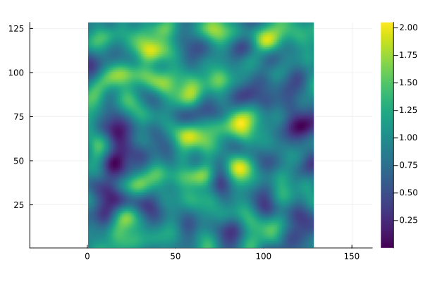
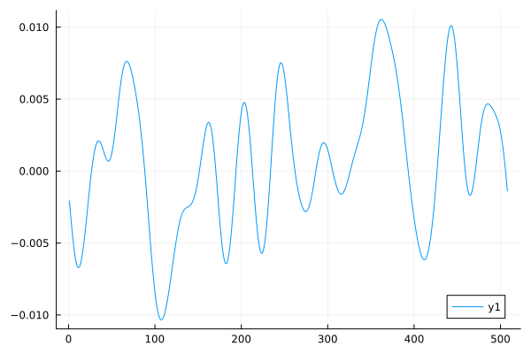
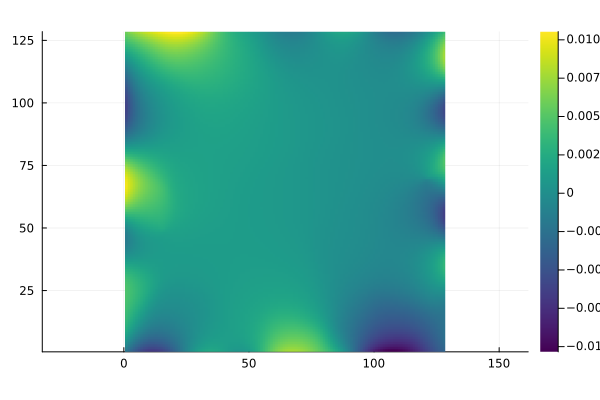

# CalderonEITFEM

Creates Training Data for Calderon/EIT Problem using FEM-solver.

1. Contains Methods for generating conductivity, and boundary conditions:
   Based on white noise with gaussian filtering. 
   Alternatively uses Gaussian Random fields. 

2. Creates Rectangular/Square or circular Mesh with varying granularity.

3. Calculates FEM Solution of both Dirichlet-to-Neumann and Neumann-to-Dirichlet Map

4. Generates Full data set of Conductivity, Voltage, Neumann boundary (Current), dirichlet boundary(voltage). If specified will also calculate full gradient flow. 

Data created is meant as training Data for Solving the inverse problem of electrical impedance tomography.

Excludes Solution using Ferrite since Gridap and Ferrite do not run in the same environment.

## Example for a square domain:
Generates random Conductivity values of a medium: 

and given dirichlet boundary condition:

calculates the Voltage U over the medium:

 