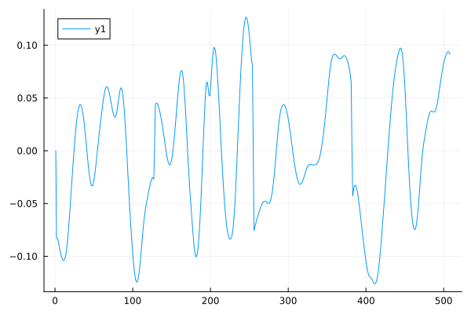
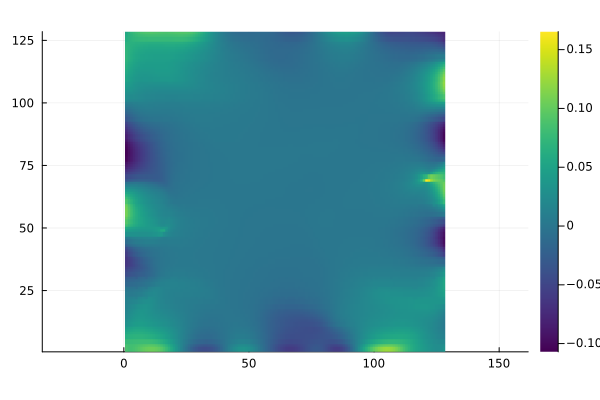
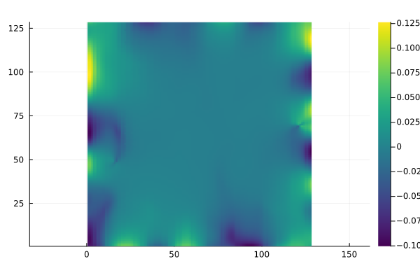
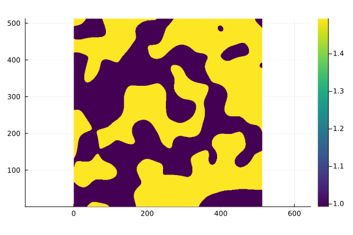
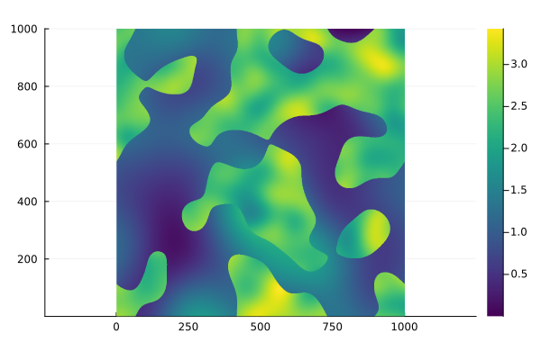

# CalderonEITFEM

Creates Training Data for Calderon/EIT Problem using FEM-solver.

1. Contains Methods for generating conductivity, and boundary conditions:
   Based on white noise with gaussian filtering. 
   Alternatively uses Gaussian Random fields. 

2. Creates Rectangular/Square or circular Mesh with varying granularity.

3. Calculates FEM Solution of both Dirichlet-to-Neumann and Neumann-to-Dirichlet Map

4. Generates Full data set of Conductivity, Voltage, Neumann boundary (Current), dirichlet boundary(voltage). If specified will also calculate full gradient flow. 

Data created is meant as training Data for Solving the inverse problem of electrical impedance tomography.

Excludes Solution using Ferrite since Gridap and Ferrite do not run in the same environment.

## The EIT - Forward Problem
Since the Electircal Impedance Problem is an Inverse Problem we have two choices given conductivity values $\gamma$ we can calculate the operator mapping from neumann boundary to dirichlet boundary or the inverse operator. 
Given one of these Boundary operators we can start solving the inverse Problem which is Electrical Impedance Tomography.
### Neumann-to-Dirichlet Map
Given the strong formulation:
$$\nabla\cdot(\gamma  \nabla u) = 0 \;\;\forall x\in\Omega$$
with neumann boundary condiction
$$\frac{\partial u(x)}{\partial \Vec{n}(x)} = g(x) \;\; x\in \partial \Omega $$
with the constraint:
$$ \int\limits_{\partial\Omega} g(x) d\mathcal{S} =0 $$

The weak solution thus becomes: 

$$ \int\limits_\Omega \gamma\nabla u\cdot\nabla v dx = \int\limits_{\partial\Omega} v d\mathcal{S} $$
### Dirichlet-to-Neumann Map
Here the strong formulation is:
$$\nabla \cdot (\gamma(x) \nabla u(x)) =0 \;\; \forall x \in \Omega $$
with dirichlet boundary condition:
$$u(x) = g(x) \;\; x\in \partial \Omega \;\; \forall x \in \\partial\Omega$$

The Weak form then becomes: 
$$ \int\limits_\Omega \gamma\nabla u\cdot\nabla v dx = 0 \;\; \forall v \in\H^{\frac{1}{2}}(\Omega) $$

## Example for a square domain:
Generates random Conductivity values of a medium: 

and given dirichlet boundary condition:

calculates the Voltage U over the medium:

 

with the option to also calculate the neumann boundary:

Or even the full gradient:

## Example Conductivity Data generated:

Other Methods to produce random conductivity:

a version with just two different values.

or a combination thereof:

